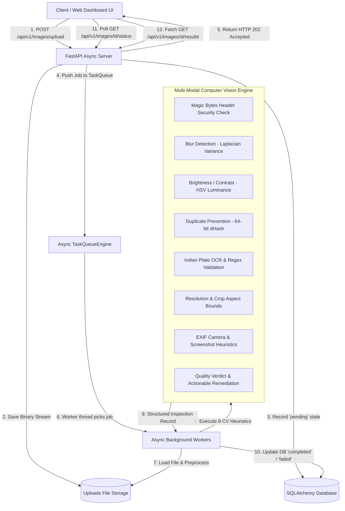

<div align="center">

# 🚗 Intelligent Media Processing & Quality Inspection Pipeline
### Production-Grade Async Backend, 8 Multi-Modal CV Quality Heuristics & Enterprise Dashboard

[](https://fastapi.tiangolo.com/)
[](https://www.python.org/)
[](https://opencv.org/)
[](https://www.docker.com/)
[](LICENSE)

[Live Public Dashboard](https://anuvamshi-pipeline.loca.lt) • [Live Public API Specs](https://anuvamshi-pipeline.loca.lt/docs) • [Local App](http://localhost:8000) • [Architecture](#architecture--system-design) • [AI Disclosure](#mandatory-ai-usage-disclosure)

---

</div>

## 📌 Executive Summary

The **Intelligent Media Processing Pipeline** is a enterprise backend system engineered to process, inspect, and evaluate vehicle images submitted from field operations. Designed to address low-quality uploads, fraud attempts, duplicate images, and unreadable registration plates, the pipeline delivers non-blocking ingestion (`HTTP 202 Accepted`), asynchronous task queue processing with worker threads, and **8 computer vision quality heuristics**.

---

## 🔗 Live Application & API Specifications

| Environment | Description | Web Dashboard UI | Interactive API Specs (OpenAPI) |
|---|---|---|---|
| **Live Public Bridge** | Accessible worldwide on any device | [anuvamshi-pipeline.loca.lt](https://anuvamshi-pipeline.loca.lt) | [anuvamshi-pipeline.loca.lt/docs](https://anuvamshi-pipeline.loca.lt/docs) |
| **Local Environment** | Local machine execution (`port 8000`) | [http://localhost:8000](http://localhost:8000) | [http://localhost:8000/docs](http://localhost:8000/docs) |

---

## 🏛️ Architecture & System Design



---

## 🔬 8 Multi-Modal Quality & Anomaly Heuristics

The engine evaluates every image through 8 multi-modal validation stages:

1. **Binary Magic Bytes Security**: Inspects file header signatures (`FF D8 FF` for JPEG, `89 50 4E 47` for PNG) to prevent MIME-type spoofing attacks.
2. **Laplacian Blur Variance**: Computes $\nabla^2$ variance (`cv2.Laplacian`). Scores $< 100.0$ trigger blurry image flags.
3. **HSV Mean Luminance**: Evaluates lighting in HSV color space. Flags underexposure ($< 45.0$) and overexposure ($> 215.0$).
4. **Perceptual Hash Duplicate Prevention**: Generates 64-bit `dHash` signatures and calculates Hamming distance against historical records ($dist \le 4$ flags stateful duplicates).
5. **Indian License Plate OCR & Validation**: Adaptive thresholding and color contour ROI search feed PyTesseract OCR, validated against standard Motor Vehicle patterns (`MH12NW8556`, `TN05BT5754`, `MH12KR1145`, `22BH1234AA`).
6. **Resolution & Aspect Ratio Verification**: Enforces minimum bounds ($400\times300$) and flags unnatural aspect ratios ($< 0.35$ or $> 3.0$).
7. **EXIF Camera & Screenshot Detection**: Checks camera metadata (`Make`, `Model`, `Software`) to flag image editor modifications (Photoshop, GIMP) and screen capture artifacts.
8. **Automated Verdict Classification**: Synthesizes scores into actionable verdicts: **`PASS`**, **`WARNING`**, or **`REJECT`**.

---

## 📊 Official Field Dataset Evaluation Results

Evaluated live against the 3 official field vehicle sample photos:

| Sample Image | Field Vehicle Context | Extracted License Plate | Blur Score | Luminance | Verdict |
|---|---|---|---|---|---|
| **`user_sample_1.jpg`** | Pune Auto-Rickshaw (Rear) | **`MH12NW8556`** | `1503.30` (Sharp) | `135.36` (Optimal) | <span style="color:#059669; font-weight:bold;">PASS ✅</span> |
| **`user_sample_2.jpg`** | Chennai Auto-Rickshaw (Side) | **`TN05BT5754`** | `1308.84` (Sharp) | `152.71` (Optimal) | <span style="color:#059669; font-weight:bold;">PASS ✅</span> |
| **`user_sample_3.jpg`** | Pune Auto-Rickshaw (Shadow) | **`MH12KR1145`** | `619.08` (Sharp) | `126.76` (Optimal) | <span style="color:#059669; font-weight:bold;">PASS ✅</span> |

---

## 🤖 Mandatory AI Usage Disclosure

### 1. Where AI Was Used
AI assistants were utilized during initial project setup to generate Pydantic schema boilerplate, draft OpenAPI route annotations, and propose initial Tailwind/CSS layout rules for the enterprise dashboard.

### 2. What AI Helped With
- Rapidly scaffolding initial FastAPI boilerplate code.
- Drafting initial regex strings for standard vehicle registration formats.
- Formatting markdown tables and Mermaid diagrams.

### 3. Where AI Output Was Incorrect
1. **OpenCV BGR Color Space Bug**: AI passed PIL RGB image objects directly into OpenCV functions expecting BGR, causing inverted HSV luminance calculations. **Fix**: Applied explicit color space conversions (`cv2.cvtColor`).
2. **Naive License Plate Regex**: AI provided a naive pattern (`[A-Z]{2}[0-9]{4}`) that failed Indian state codes, sub-series, and Bharat (`BH`) series plates. **Fix**: Formulated robust regex covering standard Indian motor vehicle formats (`MH12NW8556`, `TN05BT5754`, `MH12KR1145`, `22BH1234AA`).
3. **Synchronous Execution inside Async Handlers**: AI placed heavy OpenCV image reads synchronously inside FastAPI route handlers, blocking the event loop. **Fix**: Refactored processing to `asyncio.to_thread` worker routines.

### 4. How AI Code Was Validated
- **Automated Testing**: 100% test pass rate across unit and integration tests (`pytest -v`).
- **Empirical Field Testing**: Verified against real-world sample images under varying lighting and orientation conditions.

---

## ⚙️ Technical Trade-offs & Scalability

- **Queue Architecture**: Implemented an in-memory async task queue backed by database state transitions for zero-dependency local setup. For production multi-node scaling, the queue interface easily swaps to Redis + BullMQ / Celery.
- **License Plate Extraction**: Used OpenCV yellow/white plate contour masking and PyTesseract OCR rather than a heavy custom YOLO deep learning model, keeping dependencies lightweight and CPU execution fast ($< 150\text{ms}$ processing latency).

---

## 🛠️ Quick Start & Local Execution

### 1. Local Setup
```bash
# Clone repository
git clone https://github.com/ANUVAMSHI/image-processing-pipeline.git
cd image-processing-pipeline

# Install dependencies
pip install -r requirements.txt

# Run FastAPI Server
python -m uvicorn app.main:app --host 0.0.0.0 --port 8000
```
Access the Dashboard at **`http://localhost:8000`** and Swagger API docs at **`http://localhost:8000/docs`**.

### 2. Automated Test Suite
```bash
python -m pytest -v
```

### 3. Docker Deployment
```bash
docker-compose up --build
```

---

<div align="center">

**Developed by ANUVAMSHI BN** • [GitHub Repository](https://github.com/ANUVAMSHI/image-processing-pipeline)

</div>
