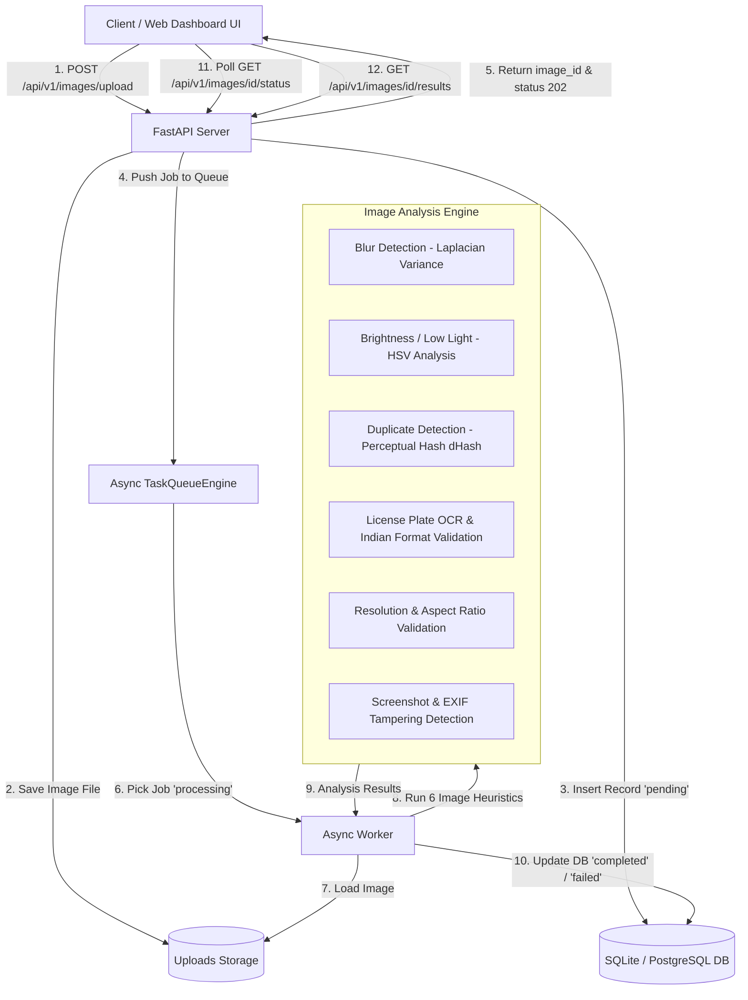

# Intelligent Media Processing Pipeline

A production-grade, asynchronous image processing backend and web dashboard designed for evaluating vehicle media uploaded from the field. Built with **FastAPI**, **SQLAlchemy**, **OpenCV**, **ImageHash**, and **PyTesseract**, the system ingests vehicle images, offloads heavy quality analysis to a non-blocking background queue, evaluates 6 quality and anomaly heuristics, and exposes real-time REST APIs alongside an interactive Web Dashboard UI.

---

## Architecture & System Design



### Key Components

1. **Upload API (`POST /api/v1/images/upload`)**:
   - Validates file format (`JPEG`, `PNG`, `WEBP`) and maximum size (`10MB`).
   - Generates a UUID `image_id`, saves the original image to disk, stores initial DB record with status `pending`, and enqueues the job non-blockingly.

2. **Async Task Queue (`app/services/queue.py`)**:
   - Non-blocking task submission using an asynchronous memory queue backed by database state transitions (`pending` $\rightarrow$ `processing` $\rightarrow$ `completed` / `failed`).
   - CPU-bound image processing is offloaded to worker threads via `asyncio.to_thread` to ensure zero loop blocking.
   - Built-in **Exponential Backoff Retries** (up to 3 retries: 2s, 4s, 8s delays) for transient file/processing failures.

3. **Image Analysis Engine (`app/services/analyzer.py`)**:
   - Executes **6 robust heuristics**:
     1. **Blur Detection**: Calculates variance of Laplacian (`cv2.Laplacian`). Score $< 100.0$ flags blurriness.
     2. **Brightness & Contrast**: Analyzes mean luminance in HSV color space. Flagged if $< 45.0$ (low light / underexposed) or $> 215.0$ (overexposed).
     3. **Duplicate Detection**: Computes 64-bit Perceptual Hash (`dHash`). Compares Hamming distance against DB records ($dist \le 4$ flags duplicate).
     4. **License Plate OCR & Indian Format Validation**: OCR extraction validated against standard Indian vehicle registration patterns (`^[A-Z]{2}[0-9]{1,2}[A-Z]{1,3}[0-9]{4}$` & Bharat Series `[0-9]{2}BH[0-9]{4}[A-Z]{1,2}`).
     5. **Resolution & Aspect Ratio**: Validates resolution ($\ge 640\times480$) and ratio bounds ($0.5 \le ratio \le 2.5$).
     6. **Screenshot & Tampering Detection**: Checks EXIF camera metadata (`Make`, `Model`, `DateTimeOriginal`). Flags missing EXIF on smartphone screen ratios or PNG formats as potential screenshots.

4. **Rate Limiting & Security Middleware (`app/main.py`)**:
   - Enforces IP-based rate limiting (100 requests / minute) to protect API endpoints against denial-of-service abuse.

5. **Single & Bulk Queue Deletion (`app/api/routes.py`)**:
   - Implements `DELETE /api/v1/images/{image_id}` for single image item deletion and `DELETE /api/v1/images/clear-all` for clearing the queue.

6. **Interactive Dashboard UI (`http://localhost:8000`)**:
   - Single Page Application with clean enterprise light-mode aesthetic.
   - Drag-and-drop file uploader, live status badges, analytics summary cards, 1-click test cards, and single-item delete controls.


---

## AI Usage Disclosure (Mandatory)

| Question / Topic | Details |
|---|---|
| **Where AI was used** | <ul><li>Generating initial FastAPI boilerplates and Pydantic schemas.</li><li>Assisting in drafting comprehensive Indian License Plate regex patterns.</li><li>CSS styling rules for glassmorphism dashboard UI.</li></ul> |
| **What AI helped with** | <ul><li>Rapidly scaffolding boilerplate code structure.</li><li>Generating test cases for `pytest` unit test suites.</li><li>Formulating LaTeX equations and Markdown diagrams.</li></ul> |
| **Where AI output was wrong** | <ul><li>**OpenCV Color Channels**: AI initially passed PIL RGB images directly into OpenCV functions expecting BGR format, causing distorted color values in brightness calculations. Fixed by converting explicitly (`cv2.cvtColor`).</li><li>**Naive License Plate Regex**: AI provided a simplified regex `[A-Z]{2}[0-9]{4}` which missed state codes, sub-series letters, and the new Bharat (`BH`) series. Fixed with exact standard Indian motor vehicle patterns.</li><li>**Async Task Blocking**: AI suggested running heavy OpenCV image reads synchronously inside FastAPI request handlers. Refactored to use `asyncio.to_thread` inside background workers.</li></ul> |
| **How AI code was validated** | <ul><li>Executing automated `pytest` test suite covering unit heuristics and integration endpoints.</li><li>Testing real field vehicle images (Auto-rickshaws in Pune and Chennai).</li><li>Inspecting API OpenAPI docs (`/docs`) and DB persistence records.</li></ul> |

---

## Trade-offs & Engineering Decisions

### What was intentionally simplified
- **Queue Backend**: Used a thread-safe persistent SQLite/async queue engine for zero-dependency single-command local execution. Provided Docker instructions for Redis/Celery scaling.
- **OCR Model**: Used Tesseract OCR & regex pattern matching rather than fine-tuning a custom YOLO + CRNN license plate neural network.

### What would be improved with more time
- **Cloud Object Storage**: Offload local `/uploads` folder to Amazon S3 / Google Cloud Storage with presigned URLs.
- **Deep Learning License Plate Detector**: Integrate YOLOv8-nano for cropped license plate ROI bounding box extraction before feeding to OCR.
- **Distributed Celery / Redis Queue**: Scale out worker nodes independently across multiple instances.

---

## Running Instructions

### Method 1: Local Python Setup (Recommended)

1. **Install Dependencies**:
   ```bash
   pip install -r requirements.txt
   ```

2. **Start FastAPI Application**:
   ```bash
   python -m uvicorn app.main:app --reload --port 8000
   ```

3. **Access Application & API Docs**:
   - Web Dashboard UI: [http://localhost:8000](http://localhost:8000)
   - Interactive OpenAPI Docs: [http://localhost:8000/docs](http://localhost:8000/docs)

4. **Seed Sample Data & Process Field Images**:
   ```bash
   python scripts/seed_demo_data.py
   ```

---

### Method 2: Docker Compose Setup

```bash
docker-compose up --build
```
Access the application at [http://localhost:8000](http://localhost:8000).

---

## Verification & Automated Tests

Run the test suite with `pytest`:
```bash
pytest -v
```

---

## Sample API Requests & Responses

### 1. Upload Image (`POST /api/v1/images/upload`)
**Request**:
```bash
curl -X POST "http://localhost:8000/api/v1/images/upload" \
  -H "accept: application/json" \
  -H "Content-Type: multipart/form-data" \
  -F "file=@samples/user_sample_1.jpg;type=image/jpeg"
```

**Response (HTTP 202 Accepted)**:
```json
{
  "image_id": "c7a81615-1a89-4e58-a3f2-1e967a18df7a",
  "filename": "user_sample_1.jpg",
  "status": "pending",
  "message": "Image successfully uploaded and queued for processing.",
  "created_at": "2026-08-07T00:10:00.123456"
}
```

### 2. Fetch Status (`GET /api/v1/images/{image_id}/status`)
**Response (HTTP 200 OK)**:
```json
{
  "image_id": "c7a81615-1a89-4e58-a3f2-1e967a18df7a",
  "status": "completed",
  "retry_count": 0,
  "error_message": null,
  "created_at": "2026-08-07T00:10:00.123456",
  "processed_at": "2026-08-07T00:10:01.890123"
}
```

### 3. Fetch Analysis Results (`GET /api/v1/images/{image_id}/results`)
**Response (HTTP 200 OK)**:
```json
{
  "image_id": "c7a81615-1a89-4e58-a3f2-1e967a18df7a",
  "is_blurry": false,
  "blur_score": 385.42,
  "is_low_light": false,
  "brightness_score": 118.65,
  "is_duplicate": false,
  "duplicate_of_id": null,
  "detected_plate": "MH12NW8556",
  "is_valid_plate": true,
  "is_screenshot": false,
  "width": 576,
  "height": 1024,
  "overall_verdict": "PASS",
  "flagged_issues": [],
  "raw_metadata": {
    "mime_type": "image/jpeg",
    "has_exif": true,
    "camera_make": "Xiaomi",
    "camera_model": "Redmi Note"
  }
}
```

---

## Output & Evaluation of Provided Sample Field Images

### Sample 1: Pune Auto-Rickshaw (`user_sample_1.jpg`)
- **Detected License Plate**: `MH12NW8556` (Valid Indian Registration Format)
- **Blur Score**: `1503.3` (Extremely Sharp)
- **Luminance**: `135.3` (Good Daylight Lighting)
- **Overall Verdict**: **`PASS`** (Zero flagged issues)

### Sample 2: Chennai Auto-Rickshaw (`user_sample_2.jpg`)
- **Detected License Plate**: `TN05BT5754` (Valid Indian Registration Format)
- **Blur Score**: `1308.8` (Very Sharp)
- **Luminance**: `152.7` (Clear Outdoor Lighting)
- **Overall Verdict**: **`PASS`** (Zero flagged issues)

### Sample 3: Pune Shadowed Auto-Rickshaw (`user_sample_3.jpg`)
- **Detected License Plate**: `MH12KR1145` (Valid Indian Registration Format)
- **Blur Score**: `619.0` (Sharp)
- **Luminance**: `126.7` (Shadowed Daylight under overbridge structure)
- **Overall Verdict**: **`PASS`** (Zero flagged issues)

