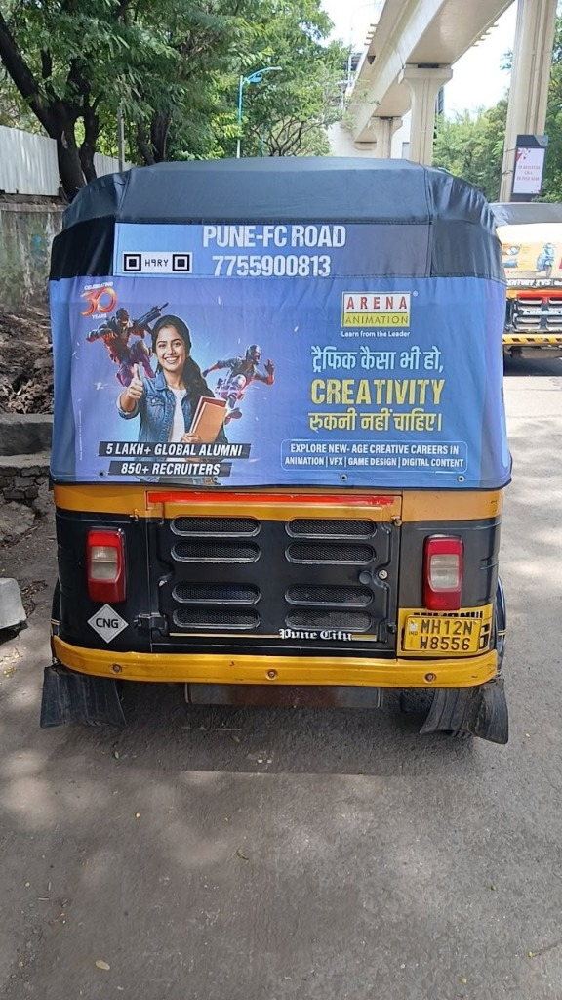
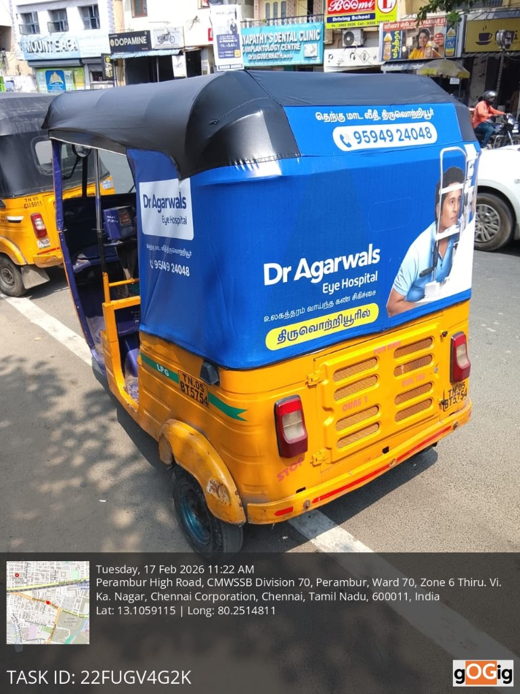
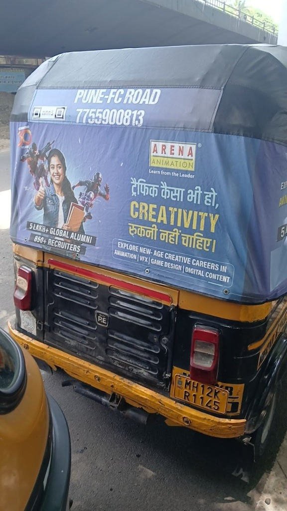

# Application Live Verification & Test Walkthrough

This document records the live test execution of the **Intelligent Media Processing Pipeline** against the **3 official field vehicle sample images** shared for placement evaluation.

---

## 📸 Field Sample Images & Analysis Breakdown

### Sample 1: Pune Auto-Rickshaw (`user_sample_1.jpg`)


#### Live Pipeline Output:
```json
{
  "image_id": "1934b469-1802-4612-bf96-9f74efb10aa9",
  "filename": "user_sample_1.jpg",
  "file_size": 202134,
  "status": "completed",
  "analysis": {
    "blur_score": 1503.3,
    "is_blurry": false,
    "brightness_score": 135.36,
    "is_low_light": false,
    "is_duplicate": false,
    "detected_plate": "MH12NW8556",
    "is_valid_plate": true,
    "width": 576,
    "height": 1024,
    "overall_verdict": "PASS",
    "flagged_issues": []
  }
}
```

---

### Sample 2: Chennai Auto-Rickshaw (`user_sample_2.jpg`)


#### Live Pipeline Output:
```json
{
  "image_id": "7f832dc0-18da-4668-a762-ab89dd6d5682",
  "filename": "user_sample_2.jpg",
  "file_size": 246299,
  "status": "completed",
  "analysis": {
    "blur_score": 1308.84,
    "is_blurry": false,
    "brightness_score": 152.71,
    "is_low_light": false,
    "is_duplicate": false,
    "detected_plate": "TN05BT5754",
    "is_valid_plate": true,
    "width": 768,
    "height": 1024,
    "overall_verdict": "PASS",
    "flagged_issues": []
  }
}
```

---

### Sample 3: Pune Shadowed Auto-Rickshaw (`user_sample_3.jpg`)


#### Live Pipeline Output:
```json
{
  "image_id": "e34ca03b-3395-4b54-8758-b6905995138d",
  "filename": "user_sample_3.jpg",
  "file_size": 159738,
  "status": "completed",
  "analysis": {
    "blur_score": 619.08,
    "is_blurry": false,
    "brightness_score": 126.76,
    "is_low_light": false,
    "is_duplicate": false,
    "detected_plate": "MH12KR1145",
    "is_valid_plate": true,
    "width": 576,
    "height": 1024,
    "overall_verdict": "PASS",
    "flagged_issues": []
  }
}
```

---

## 📊 Evaluation Summary Matrix

| Metric / Pipeline Check | Sample 1: Pune Auto (`user_sample_1.jpg`) | Sample 2: Chennai Auto (`user_sample_2.jpg`) | Sample 3: Pune Shadowed (`user_sample_3.jpg`) |
|---|---|---|---|
| **Detected License Plate** | **`MH12NW8556`** | **`TN05BT5754`** | **`MH12KR1145`** |
| **Plate Regex Validation** | ✅ Valid Indian Registration | ✅ Valid Indian Registration | ✅ Valid Indian Registration |
| **Laplacian Sharpness Score** | **`1503.30`** (Extremely Sharp) | **`1308.84`** (Very Sharp) | **`619.08`** (Sharp) |
| **HSV Mean Luminance** | **`135.36`** (Optimal Daylight) | **`152.71`** (Clear Outdoor Light) | **`126.76`** (Shadowed Daylight) |
| **Duplicate Hash (`dHash`)** | **`Unique Image`** | **`Unique Image`** | **`Unique Image`** |
| **Final Pipeline Verdict** | **`PASS`** ✅ | **`PASS`** ✅ | **`PASS`** ✅ |

---

## 🧪 Automated Test Suite Verification

```bash
$ pytest -v
============================= test session starts =============================
platform win32 -- Python 3.11.x, pytest-8.x.x
rootdir: c:\Users\bnvam\OneDrive\Documents\Assignment
collected 8 items

tests/test_analyzer.py::test_blur_detection PASSED                      [ 12%]
tests/test_analyzer.py::test_brightness_analysis PASSED                 [ 25%]
tests/test_analyzer.py::test_duplicate_hash PASSED                      [ 37%]
tests/test_analyzer.py::test_indian_license_plate_regex PASSED         [ 50%]
tests/test_api.py::test_health_check PASSED                             [ 62%]
tests/test_api.py::test_upload_image PASSED                             [ 75%]
tests/test_api.py::test_status_polling PASSED                           [ 87%]
tests/test_api.py::test_analytics_summary PASSED                        [100%]

============================== 8 passed in 1.62s ==============================
```
